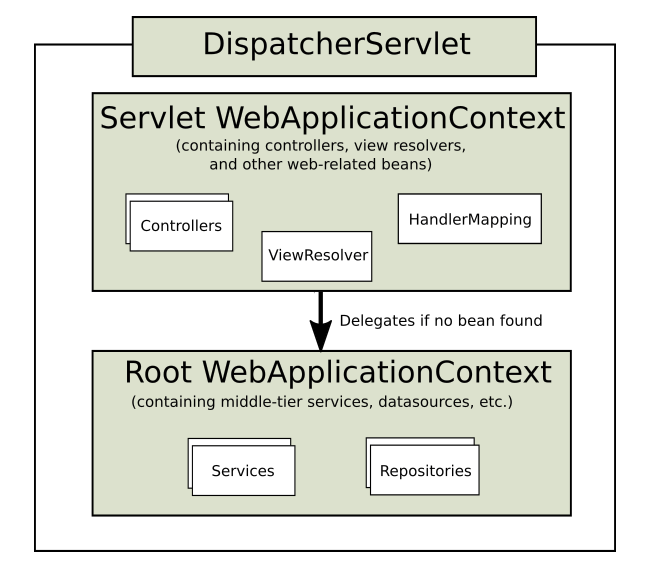
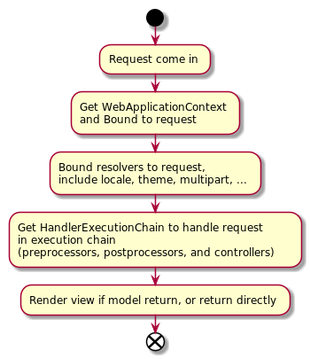

# Spring Web MVC

用于构建Servlet-stack的web应用, 例如tomcat, jetty, ...

同很多web框架的设计一样, 基于[front controller pattern][]设计,
通过**DispatcherServlet**来对request进行处理.

WebApplicationContext会被绑定到**ServletContext**和**Servlet**中,
可以通过**RequestContextUtils**来获取它.

DispatcherServlet会使用WebApplicationContext来对应用进行配置,
尤其是请求处理相关的[Special Bean Types][].
如果没有在应用中进行配置, 则会使用**DispatcherServlet.properties**中的设置作为默认值.

在Servlet 3.0+环境中, 可以通过**WebApplicationInitializer**在应用中对Servlet进行配置.

## DispatcherServlet 工作流

DispatcherServlet代理了一系列的HandlerExceptionResolver, 用于处理请求分发和处理时发生的异常.

如果异常没有被HandlerExceptionResolver处理, 则最后会被抛给Servlet Container处理, 最后会分发给error page.

Spring MVC通过ViewResolver和View来渲染model到页面, 可以配置一些列的ViewResolver来处理不同的显示.

ContentNegotiatingViewResolver用于代理其他第三方的ViewResolver, 根据请求的Content-Type来选择合适的ViewResolver.

通过LocaleResolver来处理国际化.

有3种方式来处理文件上传, 通过定义bean **multipartResolver**:

- MultipartResolver, 基于POST和multipart/form-data
- CommonsMultipartResolver, 基于apache的commons-fileupload
- StandardServletMultipartResolver, 基于Servlet 3.0

## Filter

Servlet API要求ServletRequest.getParameter*()方法只支持HTTP POST.

spring-web通过**FormContentFilter**来扩展ServletRequest.getParameter*(),
支持Content-Type为**application/x-www-form-urlencoded的HTTP PUT, PATCH, 以及DELETE**

## Annotated Controller

Spring通过ComponentScan来将所有的Controller加载.

使用ResponseBody将返回直接写入到请求回复正文, 而不是使用模板引擎进行渲染.

请求匹配中涉及到的元素:

- HTTP Method
- URI, 使用关键字path
- Content-Type, 即Consumable Media Types, 使用关键字consumes
- Accept, 即Producible Media Types, 使用关键字produces
- Query String和header中的参数

URI中的参数默认会使用简单类型进行转换, 对自定义类型可以通过[Type Conversion][]和[DataBinder][]进行处理

URI中的参数定义格式: `{varName:regex}`

Spring MVC使用PathMatcher和AntPathMatcher来实现请求URI的路径匹配.

URI后缀匹配指的是请求URI的后缀如果是一个文件扩展符, 则会在请求返回中使用对应的Content-Type来处理, **建议关闭该功能**.

---
[Web on Servlet Stack]: https://docs.spring.io/spring-framework/docs/current/spring-framework-reference/web.html
[front controller pattern]: https://en.wikipedia.org/wiki/Front_controller
[Special Bean Types]: https://docs.spring.io/spring-framework/docs/current/spring-framework-reference/web.html#mvc-servlet-special-bean-types
[Forwarded HTTP Extension]: https://tools.ietf.org/html/rfc7239
[Type Conversion]: https://docs.spring.io/spring-framework/docs/current/spring-framework-reference/web.html#mvc-ann-typeconversion
[DataBinder]: https://docs.spring.io/spring-framework/docs/current/spring-framework-reference/web.html#mvc-ann-initbinder