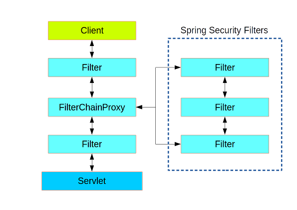
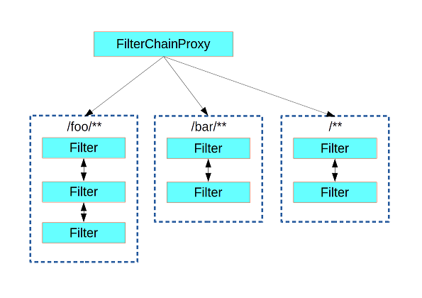
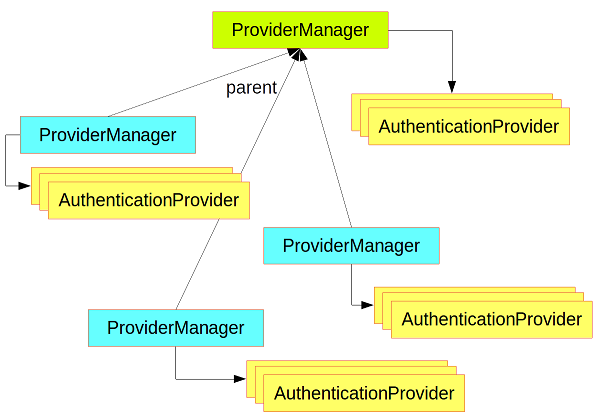

# 初识 Spring Security

## Web Security

Spring Security的鉴权系统是基于**Servlet Filters**,
它将FilterChainProxy插入到Servlet Filter的调用链中.

FilterChainProxy包含一系列的Filter调用链, 每个调用链可用于处理不同的url;
它会将请求分发到第一个匹配url pattern的Filter调用链.

一个Filter调用链通常包含以下相关功能的Filter:

- authentication
- authorization
- exception handling
- session handling
- header writing

通过重写(Override)**WebSecurityConfigurerAdapter::configure**,
对Filter调用链进行配置, 对相关url的请求进行鉴权处理

## Authentication 认证基本元素

- AuthenticationManager, 认证通过则返回Authentication, 失败则抛出AuthenticationException, 无法判断则返回null
  + ProviderManager, 包含一系列的AuthenticationProvider, 用于认证处理
- AuthenticationProvider, 对特定的Authentication进行认证处理

可以针对不同的url定义不同的ProviderManager来进行不同的认证处理

AuthenticationManager有两种:

- global, 只有一个
- local, 可以针对不同的资源来配置多个, 一般可以通过AuthenticationManagerBuilder来配置

## Authorization --- Access Control

默认情况下, 用户成功登录后, 会被重导向到之前的url.

## Reference

- [Spring Security Architecture](https://spring.io/guides/topicals/spring-security-architecture/)
- [Securing a Web Application](https://spring.io/guides/gs/securing-web/)
- [Spring Security](https://spring.io/projects/spring-security)